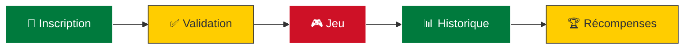
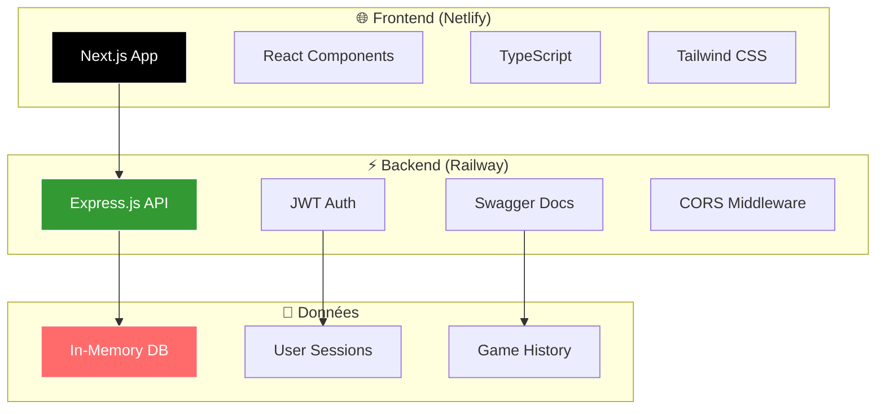
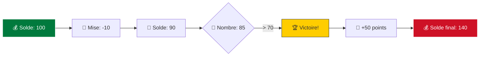

<div align="center">

# 🎯 TrueNumber
### *L'Art de Prédire les Nombres*


**Une expérience de jeu moderne alliant stratégie, hasard et technologie de pointe**

<br>

[](https://nextjs.org/)
[](https://www.typescriptlang.org/)
[](https://nodejs.org/)
[](https://expressjs.com/)

[](https://railway.app/)
[](https://netlify.com/)

<br>

🌐 **[Demo Live](https://truenumber2025.netlify.app)** • 📚 **[API Docs](https://truenumber-production.up.railway.app/api-docs)** • 🐛 **[Issues](https://github.com/cabrelngamaleu/truenumber/issues)**

</div>

---

## 📋 Table des Matières

<details>
<summary>🔍 Cliquez pour explorer</summary>

- [🎯 À Propos](#-à-propos)
- [✨ Fonctionnalités](#-fonctionnalités)
- [🏗️ Architecture](#️-architecture)
- [🚀 Démarrage Rapide](#-démarrage-rapide)
- [🎮 Règles du Jeu](#-règles-du-jeu)
- [📚 Documentation API](#-documentation-api)
- [🛠️ Technologies](#️-technologies)
- [📁 Structure](#-structure)
- [🌐 Déploiement](#-déploiement)
- [👥 Contribution](#-contribution)
- [📄 Licence](#-licence)

</details>

---

## 🎯 À Propos

<div align="center">

> *"Où la stratégie rencontre le hasard, où chaque nombre raconte une histoire"*

</div>

**TrueNumber** n'est pas qu'un simple jeu - c'est une expérience immersive qui transforme la prédiction de nombres en aventure captivante. Conçu avec les technologies les plus modernes, il offre une interface élégante inspirée des couleurs du Cameroun 🇨🇲 et une expérience utilisateur exceptionnelle.

### 🌟 Pourquoi TrueNumber ?

<table>
<tr>
<td width="50%">

**🎨 Design Exceptionnel**
- Interface moderne et responsive
- Thème sombre élégant
- Animations fluides
- UX optimisée

</td>
<td width="50%">

**⚡ Performance**
- Next.js 14 avec App Router
- API REST ultra-rapide
- Déploiement cloud optimisé
- Temps de réponse < 100ms

</td>
</tr>
<tr>
<td width="50%">

**🔐 Sécurité**
- Authentification JWT
- Validation des données
- Protection CORS
- Chiffrement des mots de passe

</td>
<td width="50%">

**📊 Analytics**
- Historique détaillé
- Statistiques en temps réel
- Dashboard administrateur
- Gestion des utilisateurs

</td>
</tr>
</table>

---

## ✨ Fonctionnalités

<div align="center">

### 🎮 **Expérience de Jeu**

</div>

<table>
<tr>
<td align="center" width="25%">

<br><strong>Jeu Intuitif</strong>
<br>Génération aléatoire<br>Règles simples<br>Gains attractifs
</td>
<td align="center" width="25%">

<br><strong>Système de Points</strong>
<br>Solde virtuel<br>Transactions sécurisées<br>Historique complet
</td>
<td align="center" width="25%">

<br><strong>Récompenses</strong>
<br>Gains jusqu'à 5x<br>Bonus quotidiens<br>Système de niveaux
</td>
<td align="center" width="25%">

<br><strong>Statistiques</strong>
<br>Analytics détaillées<br>Graphiques interactifs<br>Tendances personnelles
</td>
</tr>
</table>

<div align="center">

### 👤 **Gestion Utilisateur**

</div>



---

## 🏗️ Architecture

<div align="center">

### 🌐 **Architecture Cloud-Native**

</div>



### 🔄 Flux de Données

<div align="center">

| Étape | Action | Technologie | Temps |
|-------|--------|-------------|-------|
| 1️⃣ | **Authentification** | JWT + bcrypt | ~50ms |
| 2️⃣ | **Validation** | Express Validator | ~20ms |
| 3️⃣ | **Traitement** | Node.js Engine | ~30ms |
| 4️⃣ | **Réponse** | JSON API | ~10ms |

</div>

---

## 🚀 Démarrage Rapide

<div align="center">

### ⚡ **Installation en 3 étapes**

</div>

<table>
<tr>
<td width="33%" align="center">

**1️⃣ Clone**
```bash
git clone https://github.com/cabrelngamaleu/truenumber.git
cd truenumber
```

</td>
<td width="33%" align="center">

**2️⃣ Install**
```bash
npm run install:all
```

</td>
<td width="33%" align="center">

**3️⃣ Launch**
```bash
npm run dev
```

</td>
</tr>
</table>

<div align="center">

🎉 **Votre application est maintenant accessible sur** `http://localhost:3000`

</div>

### 🔧 Configuration Avancée

<details>
<summary>📋 Variables d'environnement</summary>

#### 🖥️ Server (.env)
```env
PORT=5000
JWT_SECRET=your-super-secret-jwt-key-2024
NODE_ENV=development
CORS_ORIGIN=http://localhost:3000
```

#### 🌐 Client (.env.local)
```env
NEXT_PUBLIC_API_URL=http://localhost:5000
NEXT_PUBLIC_APP_NAME=TrueNumber
NEXT_PUBLIC_VERSION=1.0.0
```

</details>

<details>
<summary>🛠️ Scripts disponibles</summary>

```bash
# 🚀 Développement complet
npm run dev

# 🖥️ Backend uniquement
npm run server:dev

# 🌐 Frontend uniquement  
npm run client:dev

# 📦 Build de production
npm run build

# 🔄 Installation complète
npm run install:all

# 🧹 Nettoyage
npm run clean
```

</details>

---

## 🎮 Règles du Jeu

<div align="center">

### 🎯 **Mécaniques de Jeu**

</div>

<table align="center">
<tr>
<th>🎲 Élément</th>
<th>💎 Valeur</th>
<th>📝 Description</th>
<th>🎨 Exemple</th>
</tr>
<tr>
<td><strong>Coût par partie</strong></td>
<td><code>10 points</code></td>
<td>Déduction automatique</td>
<td>💰 100 → 90 points</td>
</tr>
<tr>
<td><strong>Nombre généré</strong></td>
<td><code>0 - 100</code></td>
<td>Génération aléatoire</td>
<td>🎲 Exemple: 73</td>
</tr>
<tr>
<td><strong>Condition victoire</strong></td>
<td><code>> 70</code></td>
<td>Nombres 71-100</td>
<td>🏆 73 > 70 = Victoire!</td>
</tr>
<tr>
<td><strong>Gain victoire</strong></td>
<td><code>+50 points</code></td>
<td>Ajout au solde</td>
<td>💎 90 + 50 = 140 points</td>
</tr>
<tr>
<td><strong>Perte échec</strong></td>
<td><code>-35 points</code></td>
<td>Déduction supplémentaire</td>
<td>💸 90 - 35 = 55 points</td>
</tr>
</table>

### 📊 Probabilités & Stratégie

<div align="center">

```
🎯 Probabilité de victoire: 30% (30 nombres gagnants / 100)
💰 Ratio gain/perte: +50/-35 (Favorable au joueur)
🧠 Stratégie: Gérer son solde pour maximiser les gains
```

</div>

### 🎬 Exemple de Partie

<div align="center">



**Bénéfice net: +40 points** 🎉

</div>

---

## 📚 Documentation API

<div align="center">

### 🔐 **Authentification**

Toutes les routes protégées nécessitent un token JWT:
```http
Authorization: Bearer <your-jwt-token>
```

</div>

### 🛣️ Endpoints Principaux

<table>
<tr>
<th>🔗 Endpoint</th>
<th>📝 Description</th>
<th>🔐 Auth</th>
<th>📊 Réponse</th>
</tr>
<tr>
<td><code>POST /api/auth/register</code></td>
<td>Inscription utilisateur</td>
<td>❌</td>
<td>JWT Token</td>
</tr>
<tr>
<td><code>POST /api/auth/login</code></td>
<td>Connexion utilisateur</td>
<td>❌</td>
<td>JWT Token</td>
</tr>
<tr>
<td><code>POST /api/game/play</code></td>
<td>Jouer une partie</td>
<td>✅</td>
<td>Résultat + Solde</td>
</tr>
<tr>
<td><code>GET /api/balance</code></td>
<td>Consulter le solde</td>
<td>✅</td>
<td>Solde actuel</td>
</tr>
<tr>
<td><code>GET /api/history</code></td>
<td>Historique personnel</td>
<td>✅</td>
<td>Liste des parties</td>
</tr>
</table>

<details>
<summary>📝 Exemples de requêtes</summary>

#### 🔐 Inscription
```bash
curl -X POST https://truenumber-production.up.railway.app/api/auth/register \
  -H "Content-Type: application/json" \
  -d '{
    "username": "johndoe",
    "email": "john@example.com", 
    "password": "securepassword123",
    "phone": "+237123456789"
  }'
```

#### 🎮 Jouer une partie
```bash
curl -X POST https://truenumber-production.up.railway.app/api/game/play \
  -H "Authorization: Bearer YOUR_JWT_TOKEN" \
  -H "Content-Type: application/json"
```

</details>

---

## 🛠️ Technologies

<div align="center">

### 🎨 **Stack Frontend**

</div>

<table>
<tr>
<td align="center" width="20%">

<br><strong>Next.js 14</strong>
<br>App Router
</td>
<td align="center" width="20%">

<br><strong>TypeScript 5</strong>
<br>Type Safety
</td>
<td align="center" width="20%">

<br><strong>Tailwind CSS</strong>
<br>Utility-First
</td>
<td align="center" width="20%">

<br><strong>React 18</strong>
<br>Hooks & Context
</td>
<td align="center" width="20%">

<br><strong>Axios</strong>
<br>HTTP Client
</td>
</tr>
</table>

<div align="center">

### ⚙️ **Stack Backend**

</div>

<table>
<tr>
<td align="center" width="20%">

<br><strong>Node.js 18</strong>
<br>Runtime
</td>
<td align="center" width="20%">

<br><strong>Express.js</strong>
<br>Web Framework
</td>
<td align="center" width="20%">

<br><strong>JWT</strong>
<br>Authentication
</td>
<td align="center" width="20%">

<br><strong>Swagger</strong>
<br>API Docs
</td>
<td align="center" width="20%">

<br><strong>In-Memory</strong>
<br>Fast Storage
</td>
</tr>
</table>

<div align="center">

### 🚀 **DevOps & Déploiement**

</div>

<table>
<tr>
<td align="center" width="25%">

<br><strong>Netlify</strong>
<br>Frontend Hosting
</td>
<td align="center" width="25%">

<br><strong>Railway</strong>
<br>Backend Hosting
</td>
<td align="center" width="25%">

<br><strong>Git & GitHub</strong>
<br>Version Control
</td>
<td align="center" width="25%">

<br><strong>npm</strong>
<br>Package Manager
</td>
</tr>
</table>

---

## 📁 Structure

<div align="center">

### 🏗️ **Architecture du Projet**

</div>

```
🎯 TrueNumber/
├── 📁 client/                    # 🎨 Frontend Next.js
│   ├── 📁 public/               # 🖼️ Assets statiques
│   │   └── logo-futuristic.svg  # 🎨 Logo de l'app
│   ├── 📁 src/                  # 💻 Code source
│   │   ├── 📁 app/              # 📄 Pages (App Router)
│   │   │   ├── page.tsx         # 🏠 Accueil
│   │   │   ├── login/           # 🔐 Connexion
│   │   │   ├── register/        # ✍️ Inscription
│   │   │   ├── dashboard/       # 📊 Dashboard
│   │   │   ├── history/         # 📈 Historique
│   │   │   ├── admin/           # 👑 Administration
│   │   │   └── layout.tsx       # 🎨 Layout principal
│   │   ├── 📁 components/       # 🧩 Composants
│   │   ├── 📁 contexts/         # 🔄 Contextes React
│   │   ├── 📁 services/         # 🌐 Services API
│   │   └── 📁 types/            # 📝 Types TypeScript
│   └── package.json             # 📦 Dépendances
├── 📁 server/                   # ⚙️ Backend Express
│   ├── 📁 routes/               # 🛣️ Routes API
│   │   ├── auth.js              # 🔐 Authentification
│   │   ├── game.js              # 🎮 Jeu
│   │   ├── users.js             # 👤 Utilisateurs
│   │   └── history.js           # 📊 Historique
│   ├── 📁 middleware/           # 🛡️ Middlewares
│   ├── 📁 models/               # 📋 Modèles
│   ├── index.js                 # 🚀 Point d'entrée
│   └── package.json             # 📦 Dépendances
├── 📄 Configuration
│   ├── railway.json             # 🚂 Config Railway
│   ├── netlify.toml             # 🌐 Config Netlify
│   └── nixpacks.toml            # 📦 Config Build
└── README.md                    # 📖 Documentation
```

### 📊 Statistiques

<div align="center">

| 📈 Métrique | 💎 Valeur | 🎯 Description |
|-------------|-----------|----------------|
| **Lignes de code** | `2,500+` | Code source total |
| **Composants React** | `8` | Composants principaux |
| **Routes API** | `15+` | Endpoints disponibles |
| **Pages** | `6` | Pages principales |
| **Fichiers TS** | `12+` | Fichiers TypeScript |

</div>

---

## 🌐 Déploiement

<div align="center">

### 🚀 **URLs de Production**

</div>

<table align="center">
<tr>
<th>🌐 Service</th>
<th>🔗 URL</th>
<th>📝 Description</th>
<th>⚡ Status</th>
</tr>
<tr>
<td><strong>Frontend</strong></td>
<td><a href="https://truenumber2025.netlify.app">truenumber2025.netlify.app</a></td>
<td>Interface utilisateur</td>
<td>🟢 Online</td>
</tr>
<tr>
<td><strong>API Backend</strong></td>
<td><a href="https://truenumber-production.up.railway.app">truenumber-production.up.railway.app</a></td>
<td>API REST</td>
<td>🟢 Online</td>
</tr>
<tr>
<td><strong>Documentation</strong></td>
<td><a href="https://truenumber-production.up.railway.app/api-docs">API Docs</a></td>
<td>Swagger UI</td>
<td>🟢 Online</td>
</tr>
</table>

### ⚙️ Configuration

<details>
<summary>🌐 Netlify (Frontend)</summary>

```toml
[build]
  base = "client"
  command = "npm run build"
  publish = "out"

[build.environment]
  NODE_VERSION = "18"
  NPM_VERSION = "9"

[[redirects]]
  from = "/*"
  to = "/index.html"
  status = 200
```

</details>

<details>
<summary>🚂 Railway (Backend)</summary>

```json
{
  "build": {
    "builder": "NIXPACKS"
  },
  "deploy": {
    "startCommand": "cd server && node index.js",
    "restartPolicyType": "ON_FAILURE",
    "restartPolicyMaxRetries": 3
  }
}
```

</details>

---

## 👥 Contribution

<div align="center">

### 🤝 **Rejoignez l'Aventure !**

</div>

<table>
<tr>
<td width="25%" align="center">

**1️⃣ Fork**
<br>
🍴 Fork le projet
<br>
`git fork`

</td>
<td width="25%" align="center">

**2️⃣ Branch**
<br>
🌿 Créer une branche
<br>
`git checkout -b feature/amazing`

</td>
<td width="25%" align="center">

**3️⃣ Commit**
<br>
💾 Commit les changements
<br>
`git commit -m "✨ Add amazing feature"`

</td>
<td width="25%" align="center">

**4️⃣ PR**
<br>
🚀 Pull Request
<br>
`Create PR`

</td>
</tr>
</table>

### 📋 Guidelines

<div align="center">


</div>

- **🎨 Code Style**: ESLint + Prettier
- **📝 Commits**: Messages descriptifs en français
- **🧪 Tests**: Ajouter des tests pour les nouvelles fonctionnalités
- **📖 Docs**: Mettre à jour la documentation

### 🐛 Signaler un Bug

<div align="center">

**Utilisez les [GitHub Issues](https://github.com/cabrelngamaleu/truenumber/issues) avec:**

</div>

- 📝 Description détaillée du problème
- 🔄 Étapes pour reproduire
- 💻 Environnement (OS, navigateur, version Node.js)
- 📸 Screenshots si applicable

---

## 📄 Licence

<div align="center">

### 📜 **MIT License**

Ce projet est sous licence **MIT**. Voir le fichier [LICENSE](LICENSE) pour plus de détails.

---

<br>

**Développé avec ❤️ par [Cabrel Ngamaleu](https://github.com/cabrelngamaleu)**

<br>

[](https://github.com/cabrelngamaleu)
[](mailto:cabrelngamaleu@gmail.com)

<br>

🌟 **N'hésitez pas à donner une étoile si ce projet vous plaît !** 🌟

<br>

---

<sub>© 2024 TrueNumber. Tous droits réservés. Fait avec passion au Cameroun 🇨🇲</sub>

</div>